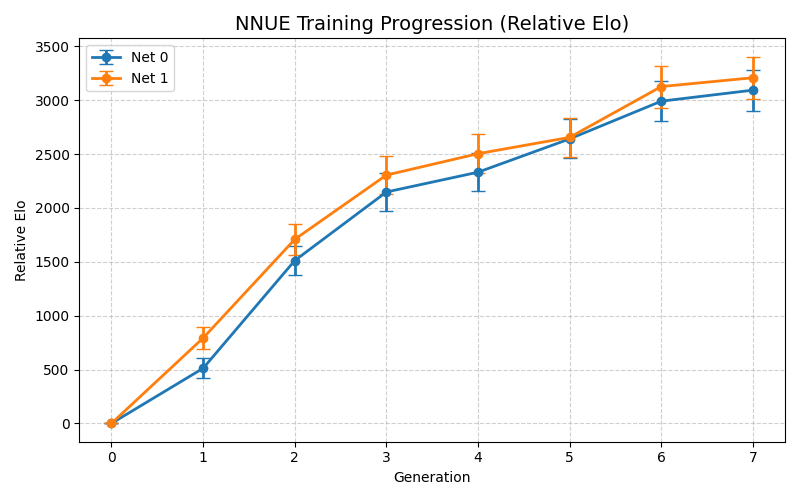

## 1. About

In this file I will track the progress of the training of my NNUE from scratch.
My idea was to start with two networks, called Net 0 and Net 1, and train them simultaneously.
I like the idea of some adversity and it probably does not have any benefit but I liked the idea so I'm rolling with it.
The two nets will constantly play against each other and generate training data along the way.

## 2. Progression 

The results for Gen x are always vs Gen x-1. For a more detailed match result see below.

#### Elo gain per generation

| Net       | Gen 0 | Gen 1               | Gen 2           | Gen 3               | Gen 4              | Gen 5              | Gen 6              | Gen 6              |
|-----------|-------|---------------------|-----------------|---------------------|--------------------|--------------------|--------------------|--------------------|
| **Net 0** | 0     | **+511.50 ± 92.45** | **+1000+ ± ?**  | **636.43 ± 109.02** | **183.78 ± 32.42** | **309.24 ± 40.38** | **350.17 ± 47.62** | **102.28 ± 22.59** |
| **Net 1** | 0     | **+792.30 ± ?**     | **+916.01 ± ?** | **596.54 ± 106.05** | **198.81 ± 32.13** | **151.58 ± 28.05** | **471.62 ± 69.61** | **81.86 ± 19.71**  |

The plot below shows the training progression over the generations with error bars. 

<div>



</div>


#### Cross-net strength

| Generation     | Match        | Elo ± Error          |
|----------------|--------------|----------------------|
| Gen 0 (random) | Net0 vs Net1 | **-349.00 ± 59.30**  |
| Gen 1          | Net0 vs Net1 | **-408.33 ± 65.87**  |
| Gen 2          | Net0 vs Net1 | **-157.03 ± 32.50**  |
| Gen 3          | Net0 vs Net1 | **-72.26 ± 19.44**   |
| Gen 4          | Net0 vs Net1 | **-45.54 ± 15.98**   |
| Gen 5          | Net0 vs Net1 | **21.91   ± 15.45**  |
| Gen 6          | Net0 vs Net1 | **-73.68   ± 19.98** |
| Gen 7          | Net0 vs Net1 | **   ± **            |
---

#### Elo estimates*

| Nets ↓    | Elo       |
|-----------|-----------|
| Net0-Gen0 | Too low   |
| Net1-Gen0 | Too low   |
| Net0-Gen1 | Too low   |
| Net1-Gen1 | Too low   |
| Net0-Gen2 | 1138      |
| Net1-Gen2 | 1257      |
| Net0-Gen3 | 1909      |
| Net1-Gen3 | 1981      |
| Net0-Gen4 | 2226      |
| Net1-Gen4 | 2271      |
| Net0-Gen5 | 2501      |
| Net1-Gen5 | 2430      |
| Net0-Gen6 | 2742 ± 13 |
| Net1-Gen6 | 2811 ± 23 |
*Based on match vs different Stash versions (8s+0.08).  
 


## 3. Baseline : Random nets (29/03/2026)

I started by creating one small brain (768->64) x 2 -> 1 (net1) and one big brain (768->1536) x 2 -> 1x8 (net0) network with random weight, generated by init.rs.
These are the play results of the random nets : 

```
Results of NET0 vs NET1 (5+0.1, 1t, 256MB, book.epd):  
Elo: -349.00 +/- 59.30, nElo: -410.25 +/- 37.26  
Games: 334, Wins: 37, Losses: 292, Draws: 5, Points: 39.5 (11.83 %)  
```

Strange observation that the big net performs a lot worse while both being random networks.
However it kinda makes sense because the small network has 3x NPS and is 'less random' than the big empty brain.

## 4. Generation 1  (30/03/2026)

### 4.1. Data generation and training

For the first run I generated 50 million positions on which both of them will train.
Net 0 for ~8 epochs, Net 1 for ~1.5 epochs.
Both of them are trained using the Bullet crate using wdl proportion = 1.0. 


### 4.2. Results vs previous generation

#### 4.2.1. Net 0

```
Results of NET0gen1 vs NET0gen0 (5+0.1, 1t, 256MB, book.epd):  
Elo: 511.50 +/- 92.45, nElo: 743.72 +/- 38.68  
Games: 310, Wins: 294, Losses: 15, Draws: 1, Points: 294.5 (95.00 %)  
```


#### 4.2.2. Net 1

Versus the random network it is a bit better, progress!

```
Results of NET1_GEN0 vs NET1_GEN1 (5+0.1, 1t, 256MB, book.epd):  
Elo: -792.30 +/- nan, nElo: -1690.22 +/- 39.99  
Games: 290, Wins: 3, Losses: 287, Draws: 0, Points: 3.0 (1.03 %)  
```

### 4.3. Results Net 0 vs Net 1

```
Results of NET0 vs NET1 (5+0.1, 1t, 256MB, book.epd):  
Elo: -408.33 +/- 65.87, nElo: -544.24 +/- 38.31  
Games: 316, Wins: 26, Losses: 287, Draws: 3, Points: 27.5 (8.70 %)  
```

The small network performs a lot better than the large network, as expected for so few positions. 
Hopefully that gap will start to close with future generations.


## 5. Generation 2 (02/04/2026)

### 5.1. Data generation and training

Again I generated 50 million positions through self play of the first generation networks.
Both networks were trained on this data. For all training I generally use batch size of 8192 and 1024 batches per superbatch.
This means that one superbatch contains around 8 million positions. 
For the 64HL network I trained for 10 superbatches ~1.5 epochs and for the 1536HL I trained for 7 superbatches ~1 epoch.

I experimented with different number of epochs but this seemed to give the best performance in SPRT testing. 
For both training sessions I used a linear WDL proportion, starting at 0.0 and ending at 1.0.

### 5.2. Results vs previous generation

Below are the results of the matches between the second generation and the first generation:

#### 5.2.1. Net 0

```
Results of NET0gen2 vs NET0gen1 (5+0.1, 1t, 256MB, book.epd):  
Elo: inf +/- nan, nElo: inf +/- nan  
Games: 294, Wins: 294, Losses: 0, Draws: 0, Points: 294.0 (100.00 %)  
```

#### 5.2.2. Net 1

```
Results of NET1gen2 vs NET1gen1 (5+0.1, 1t, 256MB, book.epd):  
Elo: 916.01 +/- nan, nElo: 2653.29 +/- 39.71  
Games: 294, Wins: 292, Losses: 1, Draws: 1, Points: 292.5 (99.49 %)  
```

### 5.3. Results Net 0 vs Net 1


In the second generation, the 64HL network still beats the 1536HL network by a considerable margin, but the gap is closing.
See the match below:

```
Results of NET1gen2 vs NET0gen2 (5+0.1, 1t, 256MB, book.epd):  
Elo: 157.03 +/- 32.50, nElo: 163.01 +/- 29.41  
Games: 536, Wins: 369, Losses: 142, Draws: 25, Points: 381.5 (71.18 %)  
```

## 6. Generation 3 (5/04/2026)

### 6.1. Data generation and training

I did some tests to see if generating and training with data from two networks is actually helpful.
For this test I generated 50million positions with only Net 1 selfplay and 100 million positions with only net0 self play.

It was interesting to see that when I trained Net 1 with data from Net 0 (50M+100M), it performed worse than just training it on data from Net 1 (50M) (around -60ELO).
But training Net 0 with data from Net 1 as well (100M+50M), gave +100 ELO over only training on the Net 0 data (100M).

Conclusion? => You can use data from a simpler net in a more complex net but not vice versa?


### 6.2. Results vs previous generation

Another 600 ELO gain this iteration!

#### 6.2.1. Net 0

```
Results of GEN3-NET0 vs GEN2-NET0 (8+0.08, 1t, 256MB, book.epd):
Elo: 636.43 +/- 109.02, nElo: 1366.59 +/- 39.32
Games: 300, Wins: 287, Losses: 2, Draws: 11, Points: 292.5 (97.50 %)
```

#### 6.2.2. Net 1


```
Results of GEN3-NET1 vs GEN2-NET1 (8+0.08, 1t, 256MB, book.epd):
Elo: 596.54 +/- 106.05, nElo: 1100.62 +/- 39.06
Games: 304, Wins: 288, Losses: 3, Draws: 13, Points: 294.5 (96.88 %)
```

### 6.3. Results Net 0 vs Net 1

```
Results of GEN3-NET1 vs GEN3-NET0 (8+0.08, 1t, 256MB, book.epd):
Elo: 72.26 +/- 19.44, nElo: 86.38 +/- 22.55
Games: 912, Wins: 428, Losses: 241, Draws: 243, Points: 549.5 (60.25 %)
```

## 7. Generation 4 (06/04/2026)

Generated 73M positions with Net1. I first wanted to generate 100M positions for each net but an idea 
came to mind to do less fresh positions per generation but do more generations in general.
So I cut this generation session short and will start this new method from generation 5.

### 7.2. Results vs previous generation


#### 7.2.1. Net 0

```
Results of GEN4-NET0 vs GEN3-NET0 (8+0.08, 1t, 256MB, book.epd):
Elo: 183.78 +/- 32.42, nElo: 218.00 +/- 31.96
Games: 454, Wins: 288, Losses: 68, Draws: 98, Points: 337.0 (74.23 %)
```

#### 7.2.2. Net 1

```
Results of GEN4-NET1 vs GEN3-NET1 (8+0.08, 1t, 256MB, book.epd):
Elo: 198.81 +/- 32.13, nElo: 257.31 +/- 33.55
Games: 412, Wins: 262, Losses: 49, Draws: 101, Points: 312.5 (75.85 %)
```

Gains are a bit less but it was also not the best quality (Net 1) data. 

### 7.3. Results Net 0 vs Net 1

```
Results of GEN4-NET0 vs GEN4-NET1 (8+0.08, 1t, 256MB, book.epd):
Elo: -45.54 +/- 15.98, nElo: -55.20 +/- 19.14
Games: 1266, Wins: 351, Losses: 516, Draws: 399, Points: 550.5 (43.48 %)
```

## 8. Generation 5 (07/04/2026)

I was reading through the paper where they trained AlphaZero and this was done by 700.000 generations with batches of around 4096 positions.
From now I will only be using Net 0 data and focus on more generations with less data and more quality.
I will increase nodes per position from 6000 to 8000 and test if 5-20M fresh positions is enough to get a gradual increase in strength.
To make sure the network does not forget what it has learned, I will experiment with different initial learning rates and let it decrease with each new generation (much like was done with AlphaZero).
Before with each generation, I always reset the LR to a rather big value. This might undo some previous features and overfit on the newest dataset.

Training parameters for this run :
* Positions : 20M Net 0
* Initial LR : 0.0001
* Final LR : 0.0001 * 0.3f32.powi(5)
* start WDL : 0.0
* end WDL : 1.0

### 8.1. Results vs previous generation


#### 8.1.1. Net 0

```
Results of GEN5_NET0 vs GEN4_NET0 (8+0.08, 1t, 256MB, book.epd):
Elo: 309.24 +/- 40.38, nElo: 456.29 +/- 36.40
Games: 350, Wins: 266, Losses: 17, Draws: 67, Points: 299.5 (85.57 %)
```

#### 8.1.2. Net 1

```
Results of GEN5_NET1 vs GEN4_NET1 (8+0.08, 1t, 256MB, book.epd):
Elo: 151.58 +/- 28.05, nElo: 188.37 +/- 30.70
Games: 492, Wins: 284, Losses: 82, Draws: 126, Points: 347.0 (70.53 %)
```

Gains are a bit less but it was also not the best quality (Net 1) data.

### 8.3. Results Net 0 vs Net 1

```
Results of GEN5_NET0 vs GEN5_NET1 (8+0.08, 1t, 256MB, book.epd):
Elo: 21.91 +/- 15.45, nElo: 24.70 +/- 17.35
Games: 1540, Wins: 689, Losses: 592, Draws: 259, Points: 818.5 (53.15 %)
```

Last iteration Net 1 was around 45 Elo stronger than Net 0 but this generation they seem about equal.
I had expected Net 0 to be 100 Elo stronger based on the results vs the previous generation.
However, Net 1 has been trained on data from Net 0 so it might over perform against it.

## 9. Generation 6 (08/04/2026)

Turned the knobs on the hyperparameters a lot here. These ones seemed to give the best performance.
Trained both Net 0 and Net 1 with the same data and parameters.

Training parameters for this run :
* Positions : 20M Net 0
* 10k nodes per position
* Initial LR : 0.001
* Final LR : 0.0001 * 0.3f32.powi(5)
* ~2 epochs
* start WDL : 0.0
* end WDL : 0.25


### 9.1. Results vs previous generation


#### 9.1.1. Net 0

```
Results of GEN6_NET0 vs GEN5_NET0 (8+0.08, 1t, 256MB, book.epd):
Elo: 350.17 +/- 47.62, nElo: 508.27 +/- 37.15
Games: 336, Wins: 275, Losses: 18, Draws: 43, Points: 296.5 (88.24 %)
```

#### 9.1.2. Net 1

```
Results of GEN6_NET1 vs GEN5_NET1 (8+0.08, 1t, 256MB, book.epd):
Elo: 471.62 +/- 69.61, nElo: 752.72 +/- 38.43
Games: 314, Wins: 286, Losses: 11, Draws: 17, Points: 294.5 (93.79 %)
```

Gains are a bit less but it was also not the best quality (Net 1) data.

### 9.2. Results Net 0 vs Net 1

```
Results of GEN6_NET0 vs GEN6_NET1 (8+0.08, 1t, 256MB, book.epd):
Elo: -73.68 +/- 19.98, nElo: -91.35 +/- 24.02
Games: 804, Wins: 220, Losses: 388, Draws: 196, Points: 318.0 (39.55 %)
```

### 9.3. Elo estimate

Estimation done vs Stash v27 ~2713 Elo.

**Net 0**

```
Results of GEN6_NET0 vs STASH21-2713 (8+0.08, 1t - NULL, 256MB, book.epd):
Elo: 29.24 +/- 12.51, nElo: 32.86 +/- 13.99
Games: 2370, Wins: 1095, Losses: 896, Draws: 379, Points: 1284.5 (54.20 %)
Ptnml(0-2): [157, 144, 463, 185, 236], WL/DD Ratio: 17.52
LLR: 2.95 (100.2%) (-2.94, 2.94) [0.00, 5.00]
```

**Net 1**

```
Results of GEN6_NET1 vs STASH21-2713 (8+0.08, 1t - NULL, 256MB, book.epd):
Elo: 98.82 +/- 23.30, nElo: 115.00 +/- 25.66
Games: 704, Wins: 403, Losses: 208, Draws: 93, Points: 449.5 (63.85 %)
Ptnml(0-2): [24, 23, 147, 50, 108], WL/DD Ratio: 13.70
LLR: 2.96 (100.5%) (-2.94, 2.94) [0.00, 5.00]
```

## 10. Generation 7 

Turned the knobs on the hyperparameters a lot here. These ones seemed to give the best performance.
Trained both Net 0 and Net 1 with the same data and parameters.

Training parameters for this run :
* Positions : 20M Net 0
* 10k nodes per position
* Initial LR : 0.0005
* Final LR : 0.0001 * 0.3f32.powi(5)
* ~2 epochs
* start WDL : 0.0
* end WDL : 0.15


### 10.1. Results vs previous generation


#### 10.1.1. Net 0

```
Results of GEN7_NET0 vs GEN6_NET0 (8+0.08, 1t, 256MB, book.epd):
Elo: 102.28 +/- 22.59, nElo: 129.68 +/- 27.00
Games: 636, Wins: 309, Losses: 127, Draws: 200, Points: 409.0 (64.31 %)
```

#### 10.1.2. Net 1

```
Results of GEN7_NET1 vs GEN6_NET1 (8+0.08, 1t, 256MB, book.epd):
Elo: 81.65 +/- 19.71, nElo: 106.71 +/- 24.80
Games: 754, Wins: 344, Losses: 170, Draws: 240, Points: 464.0 (61.54 %)
```


### 10.2. Results Net 0 vs Net 1

```

```

### 10.3. Elo estimate


**Net 0**

```

```

**Net 1**

```

```